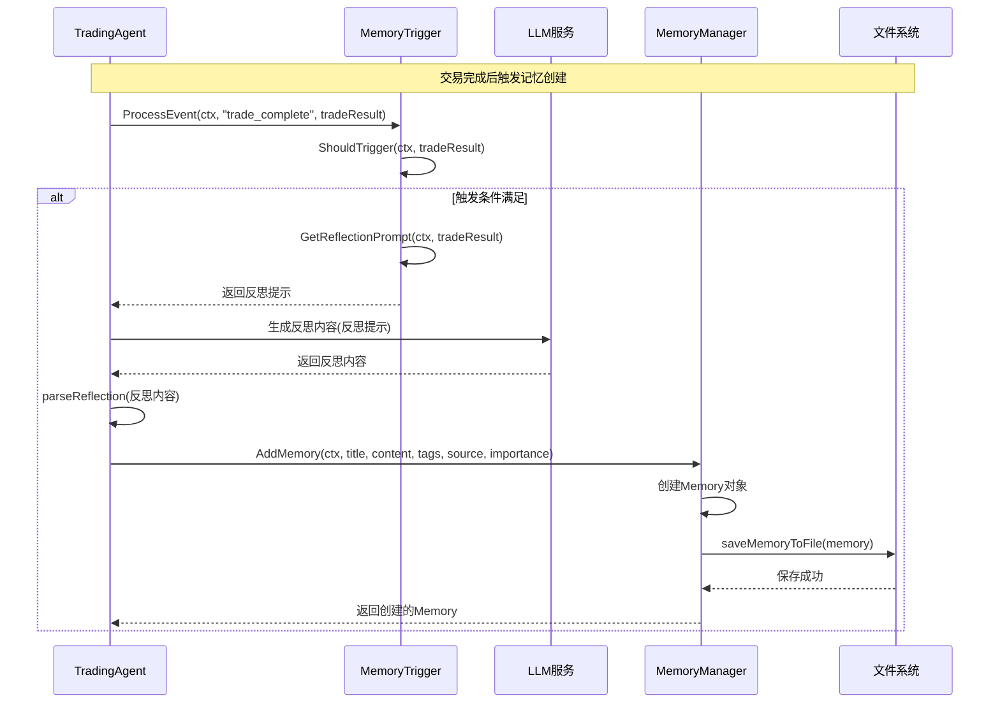
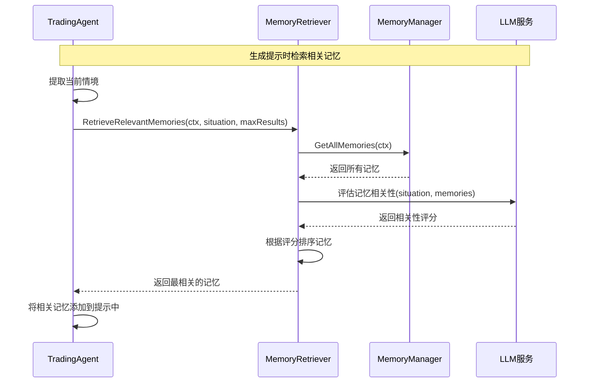

# Trading-GPT 记忆模块详细设计

## 1. 模块概述

记忆模块是 Trading-GPT 系统的核心组件之一，负责存储、管理和检索交易经验和反思。该模块专注于保存有价值的交易经验总结，而非详细的聊天历史，使交易代理能够从历史经验中学习，提高决策质量。

### 1.1 设计目标

- 存储从历史交易中总结的经验和反思
- 提供高效的记忆检索机制，支持基于相关性的查询
- 在适当时机自动生成交易反思
- 使用 Markdown 文件格式存储记忆，便于人工查看和编辑
- 与交易代理系统无缝集成

### 1.2 功能范围

- 记忆的创建、存储和加载
- 基于关键词和标签的基础检索
- 基于 LLM 的相关性检索
- 记忆触发机制
- 反思生成和解析
- 记忆查询命令支持

## 2. 接口设计

### 2.1 核心接口定义

#### 2.1.1 Memory 结构

```go
// Memory 表示一条交易经验记忆
type Memory struct {
    ID          string    // 唯一标识符
    Title       string    // 记忆标题
    Content     string    // 记忆内容（经验总结）
    Tags        []string  // 标签，用于分类和检索
    CreatedAt   time.Time // 创建时间
    Source      string    // 记忆来源（如"交易反思"、"市场分析"等）
    Importance  int       // 重要性评分（1-10）
}
```

#### 2.1.2 IMemoryManager 接口

```go
// IMemoryManager 管理交易记忆
type IMemoryManager interface {
    // 初始化管理器，加载现有记忆
    Initialize(ctx context.Context) error
    
    // 添加新记忆
    AddMemory(ctx context.Context, title, content string, tags []string, source string, importance int) (*Memory, error)
    
    // 获取指定ID的记忆
    GetMemory(ctx context.Context, id string) (*Memory, error)
    
    // 获取所有记忆
    GetAllMemories(ctx context.Context) ([]Memory, error)
    
    // 基本检索功能
    RetrieveMemories(ctx context.Context, query string, tags []string, limit int) ([]Memory, error)
}
```

#### 2.1.3 IMemoryRetriever 接口

```go
// IMemoryRetriever 提供高级记忆检索功能
type IMemoryRetriever interface {
    // 使用LLM检索与当前情境最相关的记忆
    RetrieveRelevantMemories(ctx context.Context, situation string, maxResults int) ([]Memory, error)
}
```

#### 2.1.4 IMemoryTrigger 接口

```go
// IMemoryTrigger 记忆触发器接口
type IMemoryTrigger interface {
    // 判断是否应该触发记忆创建
    ShouldTrigger(ctx context.Context, data interface{}) bool
    
    // 获取触发器类型
    GetTriggerType() string
    
    // 获取反思提示
    GetReflectionPrompt(ctx context.Context, data interface{}) (string, error)
}
```

### 2.2 TradingAgent 集成接口

```go
// TradingAgent 中与记忆相关的方法
type TradingAgent interface {
    // 处理事件并触发记忆创建
    ProcessEvent(ctx context.Context, eventType string, data interface{}) error
    
    // 从反思创建记忆
    createMemoryFromReflection(ctx context.Context, prompt string, triggerType string) error
    
    // 获取与当前情况相关的记忆
    GetRelevantMemories(ctx context.Context, situation string, tags []string, limit int) ([]Memory, error)
    
    // 添加交易经验记忆
    AddTradeMemory(ctx context.Context, title, content string, tags []string, importance int) error
}
```

## 3. 类图设计

```mermaid
classDiagram
    class Memory {
        +string ID
        +string Title
        +string Content
        +string[] Tags
        +time.Time CreatedAt
        +string Source
        +int Importance
    }
    
    class MemoryManager {
        -string baseDir
        -Memory[] memories
        -sync.RWMutex mutex
        -bool initialized
        +Initialize(ctx) error
        +AddMemory(ctx, title, content, tags, source, importance) *Memory
        +GetMemory(ctx, id) *Memory
        +GetAllMemories(ctx) []Memory
        +RetrieveMemories(ctx, query, tags, limit) []Memory
        -saveMemoryToFile(memory) error
        -loadMemoryFromFile(filepath) Memory
    }
    
    class MemoryRetriever {
        -MemoryManager manager
        -llms.Model llm
        +RetrieveRelevantMemories(ctx, situation, maxResults) []Memory
        -evaluateRelevance(ctx, situation, memories) []int
    }
    
    class MemoryTrigger {
        <<interface>>
        +ShouldTrigger(ctx, data) bool
        +GetTriggerType() string
        +GetReflectionPrompt(ctx, data) string
    }
    
    class TradeCompleteTrigger {
        +ShouldTrigger(ctx, data) bool
        +GetTriggerType() string
        +GetReflectionPrompt(ctx, data) string
    }
    
    class PeriodicTrigger {
        -time.Duration interval
        -time.Time lastTime
        +ShouldTrigger(ctx, data) bool
        +GetTriggerType() string
        +GetReflectionPrompt(ctx, data) string
    }
    
    class TradingAgent {
        -MemoryManager memoryManager
        -MemoryRetriever memoryRetriever
        -MemoryTrigger[] memoryTriggers
        -bool memoryEnabled
        +ProcessEvent(ctx, eventType, data) error
        +GetRelevantMemories(ctx, situation, tags, limit) []Memory
        +AddTradeMemory(ctx, title, content, tags, importance) error
        -createMemoryFromReflection(ctx, prompt, triggerType) error
        -parseReflection(reflection) (title, content, tags, importance)
    }
    
    MemoryManager ..|> IMemoryManager
    MemoryRetriever ..|> IMemoryRetriever
    TradeCompleteTrigger ..|> MemoryTrigger
    PeriodicTrigger ..|> MemoryTrigger
    TradingAgent --> MemoryManager
    TradingAgent --> MemoryRetriever
    TradingAgent --> MemoryTrigger
    MemoryRetriever --> MemoryManager
    MemoryRetriever --> "llms.Model"
```

## 4. 核心流程时序图

### 4.1 记忆创建流程



**流程说明**：

1. 当交易完成后，TradingAgent 调用 ProcessEvent 方法，传入事件类型和交易结果
2. MemoryTrigger 判断是否满足触发条件
3. 如果满足条件，获取反思提示并返回给 TradingAgent
4. TradingAgent 调用 LLM 服务，使用反思提示生成反思内容
5. TradingAgent 解析反思内容，提取标题、内容、标签和重要性
6. TradingAgent 调用 MemoryManager 的 AddMemory 方法创建新记忆
7. MemoryManager 创建 Memory 对象并保存到文件系统
8. 返回创建的 Memory 对象给 TradingAgent

### 4.2 记忆检索流程



**流程说明**：

1. TradingAgent 在生成提示时，提取当前交易情境
2. TradingAgent 调用 MemoryRetriever 的 RetrieveRelevantMemories 方法
3. MemoryRetriever 从 MemoryManager 获取所有记忆
4. MemoryRetriever 调用 LLM 服务评估每条记忆与当前情境的相关性
5. MemoryRetriever 根据相关性评分对记忆进行排序
6. 返回评分最高的记忆给 TradingAgent
7. TradingAgent 将相关记忆添加到提示中，供 LLM 生成交易决策时参考

## 5. 数据存储设计

### 5.1 Markdown 文件格式

每个记忆将存储为一个独立的 Markdown 文件，格式如下：

```markdown
---
id: 1234-5678-90ab-cdef
title: 市场急跌时的应对策略
tags: 风险管理, 市场波动, 止损
created_at: 2023-06-15T14:30:00Z
source: trade_reflection
importance: 8
---

在市场出现急跌时，应立即评估持仓风险，而不是盲目加仓。

本次交易中，市场突然下跌5%，我选择了立即设置更紧的止损，而不是试图抄底，这避免了更大的损失。

经验表明，市场恐慌时通常会超调，等待企稳信号再入场通常是更好的策略。
```

### 5.2 文件存储结构

```
data/
  memories/
    1234-5678-90ab-cdef.md  # 记忆文件，以UUID命名
    5678-90ab-cdef-1234.md
    ...
```

## 6. 实现计划

### 6.1 阶段一：基础功能

1. 实现 Memory 结构和 MemoryManager
2. 实现 Markdown 文件存储和加载
3. 实现基本检索功能
4. 在 TradingAgent 中集成 MemoryManager

### 6.2 阶段二：高级功能

1. 实现 MemoryTrigger 接口和具体触发器
2. 实现 MemoryRetriever 和 LLM 辅助的相关性检索
3. 实现记忆查询命令
4. 实现定期反思功能

### 6.3 阶段三：优化和测试

1. 优化记忆格式和存储
2. 添加记忆管理功能（如删除、编辑）
3. 编写单元测试和集成测试
4. 性能优化和文档完善

## 7. 安全和性能考虑

### 7.1 安全考虑

- 记忆文件使用安全的文件权限
- 敏感信息（如具体交易金额）在保存前脱敏
- 用户手动添加的记忆进行内容验证

### 7.2 性能考虑

- 记忆加载在启动时完成，避免运行时IO开销
- 记忆检索使用缓存机制
- 对于大量记忆，使用分页加载和索引优化

## 8. 配置项

```go
type MemoryConfig struct {
    Enabled     bool   `json:"enabled" yaml:"enabled"`         // 是否启用记忆功能
    Dir         string `json:"dir" yaml:"dir"`                 // 记忆文件存储目录
    MaxResults  int    `json:"max_results" yaml:"max_results"` // 检索返回的最大记忆数量
}

type TradingAgentConfig struct {
    // 现有字段...
    Memory MemoryConfig `json:"memory" yaml:"memory"` // 记忆配置
}
```

## 9. 依赖关系

- 依赖 `pkg/llms` 模块提供 LLM 服务
- 依赖 `pkg/types` 模块提供基础数据类型
- 被 `pkg/agents/trading` 模块依赖，提供记忆功能
