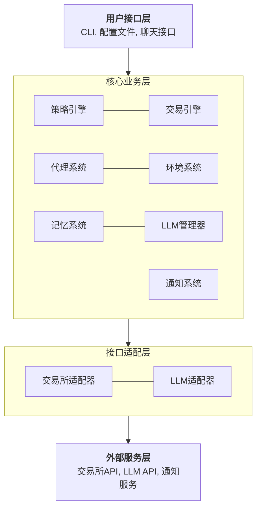
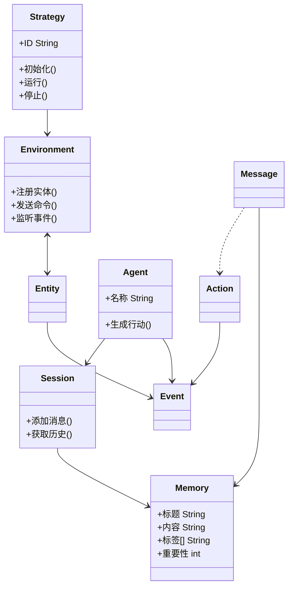
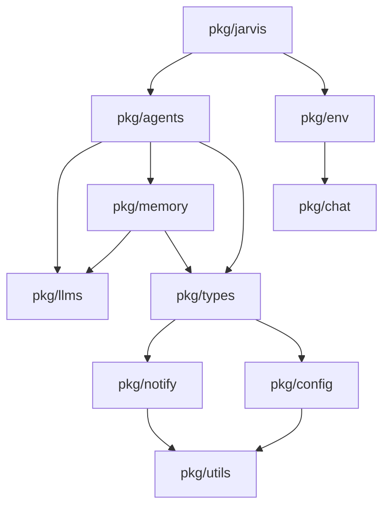

# Trading-GPT 技术方案

## 目录

- [1. 需求描述](#1-需求描述)
  - [1.1 核心功能需求](#11-核心功能需求)
  - [1.2 用户场景](#12-用户场景)
- [2. 需求分析](#2-需求分析)
  - [2.1 功能需求分析](#21-功能需求分析)
  - [2.2 非功能需求分析](#22-非功能需求分析)
  - [2.3 约束条件](#23-约束条件)
  - [2.4 假设和依赖](#24-假设和依赖)
- [3. 概要设计](#3-概要设计)
  - [3.1 架构说明](#31-架构说明)
  - [3.2 领域模型说明](#32-领域模型说明)
  - [3.3 模块和模块关系说明](#33-模块和模块关系说明)
- [4. 详细设计文档](#4-详细设计文档)

## 1. 需求描述

Trading-GPT 是一个基于大语言模型（LLM）的智能交易机器人系统，旨在通过自然语言描述来创建和执行交易策略。该系统基于 [bbgo](https://github.com/c9s/bbgo) 和 [langchaingo](https://github.com/tmc/langchaingo) 构建，提供了一种创新的方式，让用户能够使用自然语言来描述和实现交易策略，而无需编写复杂的代码。

### 1.1 核心功能需求

1. **自然语言交易策略**：允许用户使用自然语言描述交易策略，系统能够理解并执行这些策略。
2. **多LLM支持**：支持多种大语言模型，包括 Google AI、OpenAI、Claude AI 和 Ollama 等。
3. **止盈止损设置**：支持在策略中设置止盈和止损点。
4. **策略交互**：允许用户与策略进行对话，了解策略执行情况和调整策略。
5. **市场数据分析**：系统能够分析市场数据，包括K线数据、技术指标等，为交易决策提供支持。
6. **多种技术指标**：支持多种技术指标，如移动平均线、布林带、RSI等。
7. **通知系统**：支持通过飞书等渠道发送交易通知和报告。
8. **自动化交易执行**：根据策略自动执行交易操作，包括开仓、平仓、调整止盈止损等。

### 1.2 用户场景

1. **简单策略场景**：用户可以使用简单的自然语言描述基本策略，如"移动平均线策略"。
2. **复杂策略场景**：用户可以描述更复杂的策略，如"这个策略利用布林带和RSI指标，在股价达到布林带上下轨时捕捉超买和超卖信号，结合RSI指标确认时机，并设置止损水平，旨在从上升和下降周期中获利。"
3. **策略监控场景**：用户可以通过聊天界面随时了解策略执行情况，查询当前持仓、盈亏等信息。
4. **策略调整场景**：用户可以通过对话方式调整现有策略的参数或切换到新策略。

## 2. 需求分析

### 2.1 功能需求分析

#### 2.1.1 自然语言交易策略

- **挑战**：将自然语言描述转换为可执行的交易逻辑。
- **解决方案**：利用大语言模型（LLM）理解自然语言描述，并将其转换为预定义的交易命令和参数。
- **关键点**：
  - 需要设计合适的提示工程（Prompt Engineering）来引导LLM生成有效的交易决策
  - 需要定义标准化的交易命令接口，以便LLM可以生成符合系统要求的指令
  - 需要处理LLM输出的不确定性和多样性

#### 2.1.2 多LLM支持

- **挑战**：不同LLM有不同的API接口、参数和能力。
- **解决方案**：设计抽象层来统一不同LLM的接口，并支持在配置中切换主要和备用LLM。
- **关键点**：
  - 需要实现适配器模式来统一不同LLM的接口
  - 需要处理不同LLM的特性差异，如上下文长度限制、温度参数等
  - 需要实现故障转移机制，当主要LLM不可用时切换到备用LLM

#### 2.1.3 止盈止损设置

- **挑战**：将自然语言描述的止盈止损策略转换为具体的价格点位。
- **解决方案**：设计专门的解析器来处理止盈止损相关的描述，并转换为具体的价格或百分比。
- **关键点**：
  - 需要支持多种止盈止损表达方式，如固定价格、百分比、追踪止损等
  - 需要与交易所API集成，确保止盈止损订单能够正确执行
  - 需要监控价格变动，及时调整止盈止损点位

#### 2.1.4 策略交互

- **挑战**：设计自然、流畅的对话接口，使用户能够方便地查询和调整策略。
- **解决方案**：实现聊天会话管理系统，支持多种通信渠道，如飞书等。
- **关键点**：
  - 需要维护会话上下文，使对话连贯
  - 需要设计命令解析器，识别用户意图
  - 需要提供丰富的查询接口，使用户能够了解策略执行情况

#### 2.1.5 市场数据分析

- **挑战**：收集、处理和分析实时市场数据，为LLM提供决策依据。
- **解决方案**：利用bbgo的市场数据接口，收集K线数据和其他市场信息，并转换为LLM可理解的格式。
- **关键点**：
  - 需要处理大量实时数据，确保系统性能
  - 需要将复杂的市场数据转换为LLM可理解的文本描述
  - 需要设计合适的数据更新频率，平衡实时性和系统负载

#### 2.1.6 多种技术指标

- **挑战**：支持多种技术指标，并使LLM能够理解和利用这些指标。
- **解决方案**：实现常用技术指标的计算，并将指标数据转换为文本描述提供给LLM。
- **关键点**：
  - 需要实现各种技术指标的计算逻辑
  - 需要设计指标数据的文本表示方式
  - 需要支持用户自定义指标配置

#### 2.1.7 通知系统

- **挑战**：设计灵活的通知系统，支持多种通知渠道和内容格式。
- **解决方案**：实现通知抽象层，支持飞书等多种通知渠道，并提供丰富的通知模板。
- **关键点**：
  - 需要支持多种通知渠道和格式
  - 需要设计通知触发机制，避免过多通知
  - 需要提供通知内容模板，使通知信息清晰有用

#### 2.1.8 自动化交易执行

- **挑战**：将LLM生成的决策转换为实际的交易操作，并确保交易安全。
- **解决方案**：设计交易执行引擎，将LLM生成的命令转换为交易所API调用，并实现风控机制。
- **关键点**：
  - 需要实现交易命令解析和执行逻辑
  - 需要处理交易所API的各种异常情况
  - 需要实现风控机制，防止错误交易导致损失

### 2.2 非功能需求分析

#### 2.2.1 性能需求

- **响应时间**：系统需要在合理时间内响应用户请求和市场变化，特别是在关键交易决策时刻。
- **吞吐量**：系统需要能够处理多个交易对和多种指标的实时数据。
- **资源利用**：系统需要高效利用计算资源，特别是在调用LLM API时。

#### 2.2.2 可靠性需求

- **容错能力**：系统需要能够处理各种异常情况，如网络中断、API限流等。
- **数据一致性**：系统需要确保交易数据的一致性，避免重复交易或遗漏交易。
- **备份恢复**：系统需要支持数据备份和恢复，确保在系统故障时能够恢复交易状态。

#### 2.2.3 安全需求

- **API密钥管理**：系统需要安全地管理交易所API密钥和LLM API密钥。
- **权限控制**：系统需要实现权限控制，确保只有授权用户能够执行交易操作。
- **交易限制**：系统需要实现交易限制，防止异常交易导致重大损失。

#### 2.2.4 可扩展性需求

- **新交易所支持**：系统架构需要支持轻松添加新的交易所。
- **新LLM支持**：系统需要能够轻松集成新的LLM。
- **新指标支持**：系统需要支持添加新的技术指标。

#### 2.2.5 可维护性需求

- **模块化设计**：系统需要采用模块化设计，使各组件松耦合。
- **日志记录**：系统需要完善的日志记录，便于问题诊断。
- **配置管理**：系统需要支持灵活的配置管理，使用户能够根据需要调整系统行为。

### 2.3 约束条件

- **技术约束**：系统基于Go语言开发，需要与bbgo和langchaingo库兼容。
- **环境约束**：系统需要能够在Docker容器中运行，便于部署和管理。
- **接口约束**：系统需要适配各交易所的API接口和限制。
- **成本约束**：系统需要控制LLM API调用成本，避免过度使用导致高额费用。

### 2.4 假设和依赖

- **假设**：
  - 用户有基本的交易知识，能够描述有意义的交易策略。
  - 交易所API和LLM API保持稳定，不会频繁变更。
  - 系统运行环境网络稳定，能够可靠连接交易所和LLM服务。

- **依赖**：
  - 依赖bbgo库提供交易所接口和基础交易功能。
  - 依赖langchaingo库提供LLM接口。
  - 依赖各LLM服务提供商的API服务。
  - 依赖交易所提供稳定的API服务。

## 3. 概要设计

> 注意：本文档提供系统的概要设计。各模块的详细设计文档存放在 `docs/modules` 目录中，以模块名称命名，如 `memory-module.md` 存放记忆模块的详细设计。

### 3.1 架构说明

#### 3.1.1 整体架构

Trading-GPT系统采用分层架构设计，主要分为以下几层：

1. **接口层**：负责与外部系统交互，包括交易所API接口、LLM API接口、通知渠道接口等。
2. **核心层**：包含系统的核心业务逻辑，如策略解析、交易决策、指标计算等。
3. **基础设施层**：提供系统运行所需的基础服务，如配置管理、日志记录、数据持久化等。

系统整体架构如下图所示：

#### 3.1.2 核心组件

1. **策略引擎（Strategy Engine）**：
   - 负责解析用户定义的自然语言策略
   - 将策略转换为系统可执行的规则和参数
   - 管理策略的生命周期

2. **交易引擎（Trading Engine）**：
   - 执行具体的交易操作，如开仓、平仓、调整止盈止损等
   - 管理交易状态和持仓信息
   - 实现风控机制，确保交易安全

3. **代理系统（Agent System）**：
   - 基于LLM实现智能交易代理
   - 分析市场数据，生成交易决策
   - 处理用户查询和指令

4. **环境系统（Environment System）**：
   - 管理交易环境，包括市场数据、技术指标等
   - 提供事件驱动机制，响应市场变化
   - 管理实体（Entity）和它们之间的交互

5. **记忆系统（Memory System）**：
   - 存储从历史交易中总结的经验和反思
   - 提供相关记忆的检索功能
   - 在适当时机自动生成交易反思

6. **LLM管理器（LLM Manager）**：
   - 管理多个LLM服务
   - 提供统一的接口访问不同的LLM
   - 实现LLM故障转移和负载均衡

7. **通知系统（Notification System）**：
   - 管理多种通知渠道
   - 格式化通知内容
   - 控制通知频率和优先级

#### 3.1.3 数据流

系统的主要数据流如下：

1. **市场数据流**：
   - 交易所 -> 交易所适配器 -> 环境系统 -> 代理系统 -> 交易决策

2. **交易指令流**：
   - 用户 -> 聊天接口 -> 代理系统 -> 环境系统 -> 交易所适配器 -> 交易所

3. **记忆数据流**：
   - 交易结果 -> 代理系统 -> 记忆系统 -> 记忆存储
   - 当前情境 -> 记忆系统 -> 相关记忆 -> 代理系统 -> 交易决策

4. **通知流**：
   - 系统事件 -> 通知系统 -> 通知渠道 -> 用户

5. **LLM交互流**：
   - 系统数据 -> LLM管理器 -> LLM API -> LLM响应 -> 系统处理

### 3.2 领域模型说明

#### 3.2.1 核心领域模型

1. **策略（Strategy）**：
   - 表示一个交易策略，包含策略ID、策略描述、配置参数等
   - 负责策略的初始化、运行和停止
   - 管理策略相关的订阅和事件处理

2. **代理（Agent）**：
   - 表示一个智能交易代理，负责生成交易决策
   - 包含代理名称、LLM配置、背景知识等
   - 提供生成交易行动的接口

3. **环境（Environment）**：
   - 表示交易系统的运行环境
   - 管理多个实体（Entity）及其交互
   - 提供事件分发机制

4. **实体（Entity）**：
   - 表示环境中的一个参与者，如交易所、指标提供者等
   - 提供命令处理接口
   - 能够发出事件通知环境

5. **记忆（Memory）**：
   - 表示一条交易经验或反思
   - 包含标题、内容、标签、重要性等属性
   - 以Markdown格式存储，便于人工查看和编辑

6. **会话（Session）**：
   - 表示一个交互会话，如用户与系统的对话
   - 维护会话状态和历史
   - 提供消息发送和接收接口

7. **事件（Event）**：
   - 表示系统中发生的事件，如K线更新、指标变化、持仓变动等
   - 包含事件类型、事件数据等
   - 可以转换为提示（Prompt）供LLM使用

8. **行动（Action）**：
   - 表示系统可执行的操作，如开仓、平仓等
   - 包含行动名称、参数等
   - 可以被解析并执行

#### 3.2.2 领域模型关系

### 3.3 模块和模块关系说明

#### 3.3.1 主要模块

1. **pkg/jarvis**：
   - 系统的主要策略模块，实现了bbgo策略接口
   - 负责初始化和协调其他模块
   - 处理系统生命周期事件

2. **pkg/agents**：
   - 实现智能交易代理
   - 包含交易代理（TradingAgent）和代理管理器（AgentKeeper）
   - 负责生成交易决策

3. **pkg/memory**：
   - 实现记忆系统
   - 管理交易经验和反思
   - 提供记忆检索和存储功能

4. **pkg/env**：
   - 实现交易环境
   - 管理实体和事件
   - 提供命令执行接口

5. **pkg/llms**：
   - 实现LLM管理器
   - 提供统一的LLM接口
   - 支持多种LLM服务

6. **pkg/chat**：
   - 实现聊天会话管理
   - 支持多种通信渠道
   - 处理用户消息

7. **pkg/notify**：
   - 实现通知系统
   - 支持多种通知渠道
   - 格式化通知内容

8. **pkg/config**：
   - 定义系统配置结构
   - 处理配置加载和验证
   - 提供配置访问接口

9. **pkg/types**：
   - 定义系统通用数据类型
   - 提供接口定义
   - 实现通用工具函数

#### 3.3.2 模块依赖关系

#### 3.3.3 关键接口

1. **IAgent接口**：
   - 定义代理的行为
   - 提供生成行动的方法
   - 允许不同类型的代理实现

2. **IMemoryManager接口**：
   - 定义记忆管理器的行为
   - 提供记忆的添加、检索和管理方法
   - 管理记忆文件的存储和加载

3. **IMemoryRetriever接口**：
   - 定义记忆检索器的行为
   - 提供基于相关性的记忆检索方法
   - 使用LLM进行相关性评估

4. **IEnvironment接口**：
   - 定义环境的行为
   - 提供事件注册和命令执行方法
   - 管理环境中的实体

5. **IEntity接口**：
   - 定义实体的行为
   - 提供命令处理方法
   - 允许实体发出事件

6. **ISession接口**：
   - 定义会话的行为
   - 提供消息处理方法
   - 维护会话状态

7. **IEvent接口**：
   - 定义事件的行为
   - 提供事件数据访问方法
   - 允许事件转换为提示

8. **IChannel接口**：
   - 定义通信渠道的行为
   - 提供消息发送和接收方法
   - 支持不同类型的通信渠道

## 4. 详细设计文档

系统各模块的详细设计文档存放在 `docs/modules` 目录中，以下是当前可用的详细设计文档：

| 模块名称 | 文档路径 | 描述 |
| --- | --- | --- |
| 记忆模块 | [`docs/modules/memory-module.md`](./modules/memory-module.md) | 记忆模块的详细设计，包括数据结构、接口和实现计划 |

随着项目的发展，更多模块的详细设计文档将添加到该目录中。每个模块的详细设计文档将包含该模块的需求分析、数据结构、接口设计、实现计划等内容。
